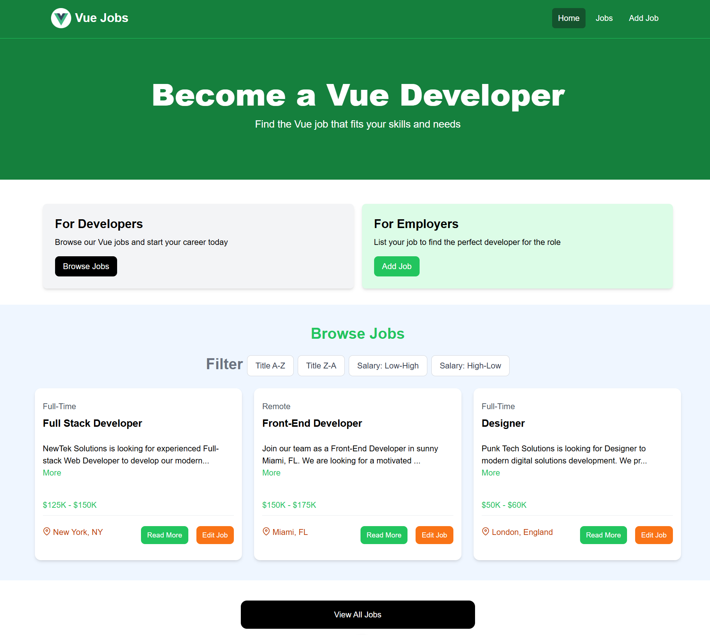

# vue-crash-course

This template should help get you started developing with Vue 3 in Vite.

## Vue Jobs Project



## Install Dependencies

```sh
npm install
cd server
npm install
```

### Run Client on http://localhost:3000

```bash
npm run client
```

### Run Server on http://localhost:5000

```bash
npm run server
```

### Run application client/server

```bash
npm run dev
```

### Build for Production

```bash
npm run build
```

### Preview Production Build

```bash
npm run preview
```

### Deployed application

https://jobs-app-vue.netlify.app/

### Docs Links

- https://v2.tailwindcss.com/docs/guides/vue-3-vite
- https://github.com/primefaces/primeicons

## Recommended IDE Setup

[VSCode](https://code.visualstudio.com/) + [Volar](https://marketplace.visualstudio.com/items?itemName=Vue.volar) (and disable Vetur).

## Customize configuration

See [Vite Configuration Reference](https://vite.dev/config/).
